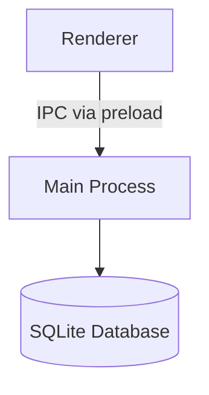

# MZO.md (Note-App / Editor)

A minimalist, local-first note app for desktop.

Built with Electron, TypeScript, Better SQLite3, and TipTap.

## Features

- Local-first note storage with SQLite
- Fast in-memory fuzzy search with fuse.js
- Markdown-focused editing with TipTap
- Export notes to Markdown, Plain Text, HTML, JSON and PDF
- Import notes from Markdown, Plain Text, HTML and JSON
- Resolve external file changes with local JIT sync
- Focus Mode and adjustable editor width (Ultrawide support)
- Light and dark theme support
- Persistent settings with electron-store
- Sanitized rendering with DOMPurify
- Runtime validation with Zod

## Stack

- Electron
- TypeScript
- Better SQLite 3
- TipTap / ProseMirror
- fuse.js
- electron-vite
- Vite
- DOMPurify
- Zod
- Lucide
- Tippy.js

## Install

Requirements:

- Node.js 20+
- npm 10+

```bash
git clone https://github.com/MZO26/MDEditor.git
cd MDEditor
npm install
```

## Scripts

| Command              | Description                           |
| -------------------- | ------------------------------------- |
| `npm run dev`        | Start development mode                |
| `npm run build`      | Build production app                  |
| `npm run pack:mac`   | Build macOS app                       |
| `npm run pack:win`   | Build Windows app                     |
| `npm run pack:linux` | Build Linux app                       |
| `npm run typecheck`  | Run TypeScript type check             |
| `npm run rebuild`    | Rebuild better sqlite 3 native module |

## Keyboard Shortcuts

Shortcuts use `$mod` which maps to `Ctrl` on Windows/Linux and `Cmd` on macOS.

## App Shortcuts

<br>
<details>
<summary><b>Click to view all App Shortcuts</b></summary>
<br>

| Shortcut                                                      | Action                |
| ------------------------------------------------------------- | --------------------- |
| <kbd>Mod</kbd> + <kbd>N</kbd>                                 | Create new note       |
| <kbd>Mod</kbd> + <kbd>G</kbd>                                 | Open global search    |
| <kbd>Mod</kbd> + <kbd>F</kbd>                                 | Open doc search       |
| <kbd>Mod</kbd> + <kbd>O</kbd>                                 | Toggle sidebar        |
| <kbd>Mod</kbd> + <kbd>Shift</kbd> + <kbd>T</kbd>              | Toggle toolbar        |
| <kbd>Mod</kbd> + <kbd>Shift</kbd> + <kbd>R</kbd>              | Toggle read-only mode |
| <kbd>Mod</kbd> + <kbd>Shift</kbd> + <kbd>W</kbd>              | Set editor width      |
| <kbd>Mod</kbd> + <kbd>,</kbd>                                 | Open settings         |
| <kbd>Mod</kbd> + <kbd>+</kbd> / <kbd>Mod</kbd> + <kbd>=</kbd> | Zoom in               |
| <kbd>Mod</kbd> + <kbd>-</kbd>                                 | Zoom out              |
| <kbd>Mod</kbd> + <kbd>0</kbd>                                 | Reset zoom            |
| <kbd>F11</kbd>                                                | Toggle focus mode     |

</details>
<br>
<details>
<summary><b>Click to view all Editor Shortcuts</b></summary>
<br>

| Shortcut                                               | Markdown     | Action                   |
| :----------------------------------------------------- | :----------- | :----------------------- |
| **History & Selection**                                |              |                          |
| <kbd>Mod</kbd> + <kbd>Z</kbd>                          |              | Undo                     |
| <kbd>Mod</kbd> + <kbd>Y</kbd>                          |              | Redo                     |
| <kbd>Mod</kbd> + <kbd>Shift</kbd> + <kbd>Z</kbd>       |              | Redo                     |
| <kbd>Mod</kbd> + <kbd>A</kbd>                          |              | Select all               |
| **Inline Formatting**                                  |              |                          |
| <kbd>Mod</kbd> + <kbd>B</kbd>                          | `**text**`   | Bold                     |
| <kbd>Mod</kbd> + <kbd>I</kbd>                          | `*text*`     | Italic                   |
| <kbd>Mod</kbd> + <kbd>Shift</kbd> + <kbd>X</kbd>       | `~~text~~`   | Strikethrough            |
| <kbd>Mod</kbd> + <kbd>Shift</kbd> + <kbd>H</kbd>       | `==text==`   | Highlight                |
| <kbd>Mod</kbd> + <kbd>E</kbd>                          | `` `code` `` | Inline code              |
| **Headings & Paragraphs**                              |              |                          |
| <kbd>Mod</kbd> + <kbd>Alt</kbd> + <kbd>1</kbd>         | `# `         | Heading 1                |
| <kbd>Mod</kbd> + <kbd>Alt</kbd> + <kbd>2</kbd>         | `## `        | Heading 2                |
| <kbd>Mod</kbd> + <kbd>Alt</kbd> + <kbd>3</kbd>         | `### `       | Heading 3                |
| <kbd>Mod</kbd> + <kbd>Alt</kbd> + <kbd>4</kbd>         | `#### `      | Heading 4                |
| <kbd>Mod</kbd> + <kbd>Alt</kbd> + <kbd>5</kbd>         | `##### `     | Heading 5                |
| <kbd>Mod</kbd> + <kbd>Alt</kbd> + <kbd>6</kbd>         | `###### `    | Heading 6                |
| **Lists**                                              |              |                          |
| <kbd>Mod</kbd> + <kbd>Shift</kbd> + <kbd>7</kbd>       | `1. `        | Ordered list             |
| <kbd>Mod</kbd> + <kbd>Shift</kbd> + <kbd>8</kbd>       | `- `         | Bullet list              |
| <kbd>Mod</kbd> + <kbd>Shift</kbd> + <kbd>9</kbd>       | `[] `        | Task list                |
| <kbd>Tab</kbd>                                         |              | Indent list item         |
| <kbd>Shift</kbd> + <kbd>Tab</kbd>                      |              | Outdent list item        |
| <kbd>Enter</kbd>                                       |              | Next list item           |
| **Blocks & Elements**                                  |              |                          |
| <kbd>Mod</kbd> + <kbd>Shift</kbd> + <kbd>B</kbd>       | `> `         | Blockquote               |
| <kbd>Mod</kbd> + <kbd>Alt</kbd> + <kbd>C</kbd>         | ` ``` `      | Code block               |
| <kbd>Mod</kbd> + <kbd>Shift</kbd> + <kbd>-</kbd>       | `---`        | Horizontal rule          |
| <kbd>Shift</kbd> + <kbd>Enter</kbd>                    |              | Hard break (`<br>`)      |
| **Links & Media**                                      |              |                          |
| <kbd>Mod</kbd> + <kbd>Alt</kbd> + <kbd>Enter</kbd>     |              | Open Link                |
| <kbd>Mod</kbd> + <kbd>K</kbd>                          |              | Toggle Link              |
| <kbd>Mod</kbd> + <kbd>Alt</kbd> + <kbd>I</kbd>         |              | Insert image             |
| **Tables**                                             |              |                          |
| <kbd>Mod</kbd> + <kbd>Alt</kbd> + <kbd>T</kbd>         |              | Insert table             |
| <kbd>Mod</kbd> + <kbd>Alt</kbd> + <kbd>↓</kbd>         |              | Add row after            |
| <kbd>Mod</kbd> + <kbd>Alt</kbd> + <kbd>↑</kbd>         |              | Add row before           |
| <kbd>Mod</kbd> + <kbd>Alt</kbd> + <kbd>→</kbd>         |              | Add column after         |
| <kbd>Mod</kbd> + <kbd>Alt</kbd> + <kbd>←</kbd>         |              | Add column before        |
| <kbd>Mod</kbd> + <kbd>Alt</kbd> + <kbd>Backspace</kbd> |              | Delete table             |
| **Editor Controls**                                    |              |                          |
| <kbd>Mod</kbd> + <kbd>Shift</kbd> + <kbd>V</kbd>       |              | Paste without formatting |
| <kbd>Mod</kbd> + <kbd>Shift</kbd> + <kbd>F</kbd>       |              | Toggle editor focus mode |
| <kbd>Escape</kbd>                                      |              | Remove focus from editor |

</details>

## Architecture

### Directory Structure

```text
.
├── electron/       # Main process
├── shared/         # Shared types, constants, schemas
└── src/            # UI, editor, styles, state
```

### Data Flow



## What this project tries to demonstrate

- Desktop app architecture with Electron
- Type-safe development with TypeScript
- Secure IPC boundaries
- Local-first application design
- SQLite schema design
- Rich editor integration without a frontend framework
- Native module handling with `electron-rebuild`
- Separation between main / renderer / shared

## Bug reports

If you find a bug or have a feature suggestion, please let me know and share your feedback.

## License

MIT
